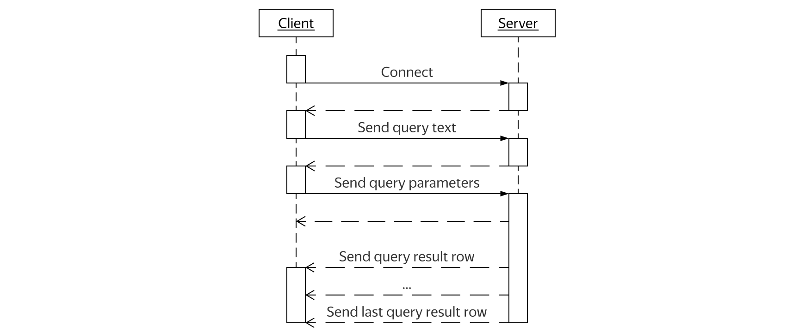

---

layout: yandex2

style:


---

# {{ site.presentation.title }}
{:.title}

### {{ site.presentation.service }}

<div class="authors">

<p>{{ site.author.name }}, {{ site.author.position }}</p>


</div>

## About
{:.section}

## What are we doing?

- Mail service
  - {:.next}Persistent storage (relational database)
  - {:.next}Consistent data
  - {:.next}Response time optimization
  - {:.next}C++ microservices
- {:.next}Highload
  - {:.next}~400TB mailbox metadata at over 100 database shards
  - {:.next}~200M users
  - {:.next}~10M active users each day

## What do we use?

- PostgreSQL
  - {:.next}Relational DBMS
  - {:.next}Composite types
  - {:.next}User defined types
  - {:.next}Binary protocol

## What do we need from client library?

- Minimum runtime cost
- {:.next}Help to avoid code mistakes
- {:.next}Simple to use

## Why do we make yet another library?

- {:.next}libpq
  - {:.next}Not even C++
  - {:.next}Require boilerplate code
- {:.next}libpqxx
  - {:.next}Only text protocol
  - {:.next}Synchronous I/O

## Why do we make yet another library?

- Internal solution: apq
  - {:.next}Without unit tests
  - {:.next}Only callbacks interface
  - {:.next}Only textual composite parameters
  - {:.next}Boilerplate to make query
  - {:.next}Synchronous send for query parameter

## What is our proposal?

- Asynchronous I/O
- {:.next}Prefer compile time over runtime
- {:.next}Compile time and runtime checks
- {:.next}Customizable interface

## Ozo
{:.section}

## Database communication model
{:.images}



## Brief example

```c++
asio::io_context io;
const auto oid_map = ozo::register_types<attach>();
ozo::connection_info<decltype(oid_map)> connection_info(io, "host=localhost");
auto pool = ozo::make_connection_pool(connection_info, config);
auto provider = ozo::make_provider(io, pool);
const auto query = "SELECT mid, st_id, attaches"_SQL
    + " FROM mail.messages "_SQL
    + "WHERE uid = "_SQL + uid
    + "  AND mid = ANY("_SQL + mids + "::code.mids)"_SQL;
using row_t = std::tuple<int, std::string, std::vector<attach>>;
std::vector<row_t> result;
ozo::request(provider, query, std::back_inserter(result), asio::use_future);
```

## How does it work?

- Boost.Asio for asynchronous network communication
- {:.next}Boost.Hana for parameters and result introspection
- {:.next}Boost.Spirit.X3 for query configuration parsing
- {:.next}Universal asynchronous interface: callbacks, futures, coroutines
- {:.next}Bind parameters to avoid SQL-injections
- {:.next}Transfer binary data to minimize traffic and CPU usage for parsing

## Connection
{:.section}

## Connection abilities

- Provide socket
- {:.next}Provide bound types
- {:.next}Provide error context
- {:.next}Optionally provide statistics storage

## Connection provider

```c++
const auto oid_map = ozo::register_types<attach>();
using oid_map_t = decltype(oid_map);
ozo::connection_info<oid_map_t> connection_info(io,
        "host=localhost"); // connection provider

ozo::connection_pool_config config;
config.queue_timeout = 300ms;
auto pool = ozo::make_connection_pool(connection_info, config);
auto provider = ozo::make_provider(io, pool); // connection provider
```

## Connection concept

```c++
template <typename, typename = std::void_t<>>
struct is_connection : std::false_type {};
template <typename T>
struct is_connection<T, std::void_t<
    decltype(get_connection_socket(std::declval<T&>())),
    decltype(get_connection_oid_map(std::declval<T&>())),
    decltype(get_connection_error_context(std::declval<T&>())),
    decltype(get_connection_statistics(std::declval<T&>())),
    // same for const ...
>> : std::true_type {};
template <typename T>
constexpr auto Connection = is_connection<std::decay_t<T>>::value; // concept
```

## User connection type

```c++
struct my_conn {
    // ...
};

auto& get_connection_oid_map(my_conn& conn) noexcept {/* ... */ }
auto& get_connection_socket(my_conn& conn) noexcept { /* ... */ }
auto& get_connection_error_context(my_conn& conn) noexcept { /* ... */ }
auto& get_connection_statistics(my_conn& conn) noexcept { /* ... */ }
```

## Connection wrapper concept

```c++
template <typename T>
struct is_nullable : std::false_type {};
template <typename T>
struct is_nullable<std::shared_ptr<T>> : std::true_type {};
// ... std::unique_ptr ...
// ... std::weak_ptr ...
// ... std::optional ...
// ... boost:: ...
template <typename T>
constexpr auto ConnectionWrapper = is_connection_wrapper<std::decay_t<T>>::value;
```

## Unwrap connection

```c++
template <typename T>
decltype(auto) unwrap_connection(T&& conn,
        Require<!ConnectionWrapper<T>>* = 0) noexcept {
    return std::forward<T>(conn);
}

template <typename T>
decltype(auto) unwrap_connection(T&& conn,
        Require<ConnectionWrapper<T>>* = 0) noexcept {
    return unwrap_connection(*conn);
}
```

## Connection and wrapper combination

```c++
template <typename, typename = std::void_t<>>
struct is_connectable : std::false_type {};

template <typename T>
struct is_connectable <T, std::void_t<
    decltype(unwrap_connection(std::declval<T&>()))
>> : std::integral_constant<bool, Connection<
    decltype(unwrap_connection(std::declval<T&>()))
>> {};

template <typename T>
constexpr auto Connectable = is_connectable<std::decay_t<T>>::value;
```

## Why concepts?

- Support custom implementation: good for unit tests
- {:.next}Minimum runtime overhead: users define only what they need
- {:.next}Support any kind of wrappers: reference, pointers, optional

## Dark side of concepts

- Compilers output for an error in template code
- {:.next}Only template code

## Use static asserts to check your type

```c++
static_assert(ozo::Connection<my_conn>,
              "my_conn does not meet Connection requirements");
static_assert(ozo::Connectable<my_conn>, /* ... */);
static_assert(ozo::ConnectionWrapper<my_conn_wrapper>, /* ... */);
static_assert(ozo::Connectable<my_conn_wrapper>, /* ... */);
```

## Type system
{:.section}

## PostgreSQL types

- PostgreSQL has builtin types with predefined OIDs
- {:.next}PostgreSQL store user types in special table
- {:.next}Query parameter and result has OID for each value

## Back to the request example

```c++
asio::io_context io;
const auto oid_map = ozo::register_types<attach>(); // <-- Look closer here
ozo::connection_info<decltype(oid_map)> connection_info(io, "host=localhost");
auto pool = ozo::make_connection_pool(connection_info, config);
auto provider = ozo::make_provider(io, pool);
const auto query = "SELECT mid, st_id, attaches"_SQL
    + " FROM mail.messages "_SQL
    + "WHERE uid = "_SQL + uid
    + "  AND mid = ANY("_SQL + mids + "::code.mids)"_SQL;
using row_t = std::tuple<int, std::string, std::vector<attach>>;
std::vector<row_t> result;
ozo::request(provider, query, std::back_inserter(result), asio::use_future);
```

## User defined type

```sql
CREATE TYPE mail.attach AS (filename text, type text, size bigint);
```

```c++
struct attach {
    std::string filename;
    std::string type;
    std::int64_t size;
};
BOOST_HANA_ADAPT_STRUCT(attach, filename, type, size);
// or BOOST_FUSION_ADAPT_STRUCT(attach, filename, type, size);
OZO_PG_DEFINE_CUSTOM_TYPE(attach, "mail.attach", dynamic_size);
```

## OID map usage

```c++
auto oid_map = ozo::register_types<attach, /* ... */>();

ozo::set_type_oid<attach>(oid_map, /* ... */);

ozo::type_oid<attach>(oid_map);

if (ozo::accepts_oid<attach>(oid_map, oid)) {
    // ...
}
```

## OID map storage

```c++
auto impl = hana::make_map(
    hana::make_pair(hana::type_c<T>, null_oid()) ......
);

impl[hana::type_c<T>] = oid;

ozo::type_oid<attach>(oid_map); // ok

struct recipient {};
ozo::type_oid<recipient>(oid_map); // compile error
```

## Query builder
{:.section}

## Back to the request example

```c++
asio::io_context io;
const auto oid_map = ozo::register_types<attach>();
ozo::connection_info<decltype(oid_map)> connection_info(io, "host=localhost");
auto pool = ozo::make_connection_pool(connection_info, config);
auto provider = ozo::make_provider(io, pool);
const auto query = "SELECT mid, st_id, attaches"_SQL
    + " FROM mail.messages "_SQL
    + "WHERE uid = "_SQL + uid
    + "  AND mid = ANY("_SQL + mids + "::code.mids)"_SQL; // <-- Look close here
using row_t = std::tuple<int, std::string, std::vector<attach>>;
std::vector<row_t> result;
ozo::request(provider, query, std::back_inserter(result), asio::use_future);
```

## Ideas for query builder

- Query text is defined as type or value
- {:.next}Parameters is part of query (both types and values)
- {:.next}Serialize parameters by using introspection

## How to send a query to PostgreSQL?

```c++
const auto query = "SELECT mid, st_id, attaches"_SQL
    + " FROM mail.messages "_SQL
    + "WHERE uid = "_SQL + 42
    + "  AND mid = ANY("_SQL + {1, 2, 3} + "::code.mids)"_SQL;
```

```sql
SELECT mid, st_id, attaches
  FROM mail.messages
 WHERE uid = $1
   AND mid = ANY($2::code.mids)
```

## Query template

```c++
const auto query = (
    "INSERT INTO mail.messages (uid, mid, st_id, attaches)"_SQL
    + "VALUES ("_SQL
        + std::cref(uid)
        + ", "_SQL + std::cref(uid)
        + ", "_SQL + std::cref(st_id)
        + ", "_SQL + std::cref(attaches)
    + ")"_SQL
).build();

std::tie(uid, mid, st_id, attaches) = /*...*/;
```

## Query builder: compile time tests

```c++
constexpr auto query = "SELECT "_SQL + 42 + " + "_SQL + 13;

static_assert(query.text() == "SELECT $1 + $2"_s,
              "query_builder should generate text in compile time");

static_assert(query.params() == hana::tuple<int, int>(42, 13),
              "query_builder should generate params in compile time");
```

## What does it give us?

- Avoid boilerplate code
- {:.next}Code type-safety (value provide type)
- {:.next}Database type-safety (check for database type support)
- {:.next}Send what you mean (bind type identifier and value)

## Query configuration
{:.section}

## Why query configuration?

- Change query without rebuild
- {:.next}Query depends on environment

## Query configuration file

```sql
-- name: GetMessages
-- attributes: ...
SELECT mid, st_id, attaches
  FROM mail.messages
 WHERE uid = :uid
   AND mid = ANY(:mids::code.mids)
```

## Query type definition

```c++
using namespace boost::hana::literals;
struct GetMessages {
    static constexpr auto name = "GetMessages"_s;
    struct parameters_type {
        std::int64_t uid;
        std::vector<std::int64_t> mids;
    };
};
BOOST_HANA_ADAPT_STRUCT(GetMessages::parameters_type, uid, mids);
// or BOOST_FUSION_ADAPT_STRUCT(GetMessages::parameters_type, uid, mids);
```

## Query repository

```c++
std::string_view query_conf_text;
const auto query_repo = ozo::make_query_repository(
        query_conf_text, hana::tuple<GetMessages>());
GetMessages::parameters_type parameters;
parameters.uid = 42;
parameters.mids = std::vector<std::int64_t>({1, 2, 3});
const auto query = query_repo.make_query<GetMessages>(parameters);

auto parameters = std::make_tuple(42, std::vector<std::int64_t>({1, 2, 3}));
query_repo.make_query<GetMessages>(parameters); // compile error
```

## Database result
{:.section}

## Back to the request example

```c++
asio::io_context io;
const auto oid_map = ozo::register_types<attach>();
ozo::connection_info<decltype(oid_map)> connection_info(io, "host=localhost");
auto pool = ozo::make_connection_pool(connection_info, config);
auto provider = ozo::make_provider(io, pool);
const auto query = "SELECT mid, st_id, attaches"_SQL
    + " FROM mail.messages "_SQL
    + "WHERE uid = "_SQL + uid
    + "  AND mid = ANY("_SQL + mids + "::code.mids)"_SQL;
using row_t = std::tuple<int, std::string, std::vector<attach>>;
std::vector<row_t> result; // <-- Look closer here
ozo::request(provider, query, std::back_inserter(result), asio::use_future);
```

## Ideas for result

- User allocate place
- {:.next}Allow to use raw result
- {:.next}Deserialization by using introspection
- {:.next}Check types OIDs

## Raw database result

```c++
ozo::result result;
ozo::request(provider, query, result, yield);
std::for_each(result.begin(), result.end(), [&] (const auto& row) {
    std::for_each(row.begin(), row.end(), [&] (const auto& value) {
        std::copy(value.data(), value.data() + value.size(), /*...*/);
    });
});
```

## Typed row

```c++
struct message {
    std::int64_t mid;
    std::string st_id;
    std::vector<attach> attaches;
};

BOOST_HANA_ADAPT_STRUCT(message, mid, st_id, attaches);
// or BOOST_FUSION_ADAPT_STRUCT(message, mid, st_id, attaches);

std::vector<message> rows;
ozo::request(provider, query, std::back_inserter(rows), asio::use_future);
```

## Boost.Hana deserialization problem

```c++
template <class T>
void read(std::istream& stream, T& value) {
    stream >> value;
}

attach a;
std::istringstream in("story.txt text/plain 146");
hana::for_each(hana::members(a), [&] (auto& v) { read(in, v); }); // compile error
fusion::for_each(a, [&] (auto& v) { read(in, v); }); // ok
```

## Boost.Hana deserialization problem solution

```c++
const auto a = hana::unpack(
    hana::fold(hana::members(attach {}), hana::tuple<>(),
        [&] (auto&& r, auto&& v) {
            std::decay_t<decltype(v)> out;
            read(in, out);
            return hana::append(std::move(r), std::move(out));
        }),
    [] (auto&& ...... args) { return attach {std::move(args) ......}; }
);
```

## Request
{:.section}

## Back to the request example

```c++
asio::io_context io;
const auto oid_map = ozo::register_types<attach>();
ozo::connection_info<decltype(oid_map)> connection_info(io, "host=localhost");
auto pool = ozo::make_connection_pool(connection_info, config);
auto provider = ozo::make_provider(io, pool);
const auto query = "SELECT mid, st_id, attaches"_SQL
    + " FROM mail.messages "_SQL
    + "WHERE uid = "_SQL + uid
    + "  AND mid = ANY("_SQL + mids + "::code.mids)"_SQL;
using row_t = std::tuple<int, std::string, std::vector<attach>>;
std::vector<row_t> result;
ozo::request(provider, query, std::back_inserter(result),
             asio::use_future); // <-- Look close here
```

## Asynchronous completion token

```c++
ozo::request(provider, query, result, [] (error_code ec, auto conn) {/*...*/});

auto future = ozo::request(provider, query, result, asio::use_future);
auto conn = future.get();

[coro = asio::coroutine {}] (error_code ec, auto conn) {
    reenter (coro) { while (true) {
        yield ozo::request(provider, query, result, *this);
    } } }

asio::spawn(io, [] (asio::yield_context yield) {
    auto conn = ozo::request(provider, query, result, yield);
});
```

## Transactions: naive implementation

```c++
auto conn = ozo::get_connection(conn_info, yield);
ozo::result result;
ozo::request(conn, "BEGIN"_SQL, result, yield);
/* ... */
ozo::request(conn, "COMMIT"_SQL, result, yield);
ozo::request(conn, "COMMIT"_SQL, result, yield); // database warning
/* ... */
ozo::request(conn, "BEGIN"_SQL, result, yield);
ozo::request(conn, "BEGIN"_SQL, result, yield); // database warning
```

## Transactions: concept implementation

```c++
ozo::result result;
auto transaction = ozo::transaction(conn_info, result, yield);
/*...*/
ozo::request(transaction, "..."_SQL, result, yield);
/*...*/
auto conn = ozo::commit(transaction, result, yield);
/*...*/
ozo::rollback(conn, result, yield); // compile error
transaction = ozo::transaction(conn, result, yield); // ok
```

## Read database result row by row

- Unknown or expected large result size
- {:.next}Streaming

<!-- ## Read row by row: library resposibility

```c++
auto on_row = [] (error_code ec, auto row) { /*...*/ };
auto on_end = [] (error_code ec, auto conn) { /*...*/ };
ozo::request_by_rows(conn, query, cursor, on_row, on_end);
```

## Read row by row: library resposibility

- ??? -->

## Read database result row by row

```c++
ozo::cursor cursor;
ozo::request(conn, query, cursor, yield);
row_t row;
while (ozo::read_count(ozo::fetch(cursor, row, yield))) {
    process(row);
}
```

## Read database result row by row: stackless coroutines

```c++
const auto cursor = make_shared<ozo::cursor>();
const auto row = make_shared<row_t>();
ozo::request(conn, query, *cursor,
    [cursor, row, coro = coroutine {}] (error_code ec, auto conn) mutable {
        if (!ec) reenter(coro) {
            while (true) {
                yield fetch(*cursor, *row, *this);
                if (!ozo::read_count(conn)) return;
                process(row);
            }
            // ...
```

<!-- ## Retries -->

## Tests
{:.section}

## Unit tests framework

- GUnit
  - {:.next}Based on googletest
  - {:.next}Textual test description
  - {:.next}Mocks without macro
    - {:.next}Virtual table patching: `-fdevirtualize` leads to SIGSEGV
    - {:.next}Runtime errors from Undefined Behavior Sanitizer

## Unit tests with mocks

```c++
GTEST("ozo::async_connect()") {
    SHOULD("start connection, assign socket and wait for write complete") {
        // ...
        connection_mock conn_mock{};

        EXPECT_CALL(conn_mock, (start_connection)("conninfo"))
            .WillOnce(Return(error_code{}));
        EXPECT_CALL(conn_mock, (assign_socket)()).WillOnce(Return(error_code{}));
        EXPECT_CALL(conn_mock, (write_poll)(_));

        ozo::impl::async_connect("conninfo", conn, wrap(cb_mock));
    }
```

## Unit tests with mocks

```c++
struct connection {
    connection_mock* mock_;
    template <typename Handler>
    friend void pq_write_poll(connection& c, Handler&& h) {
        c.mock_->write_poll([h] (auto e) {
            asio_post(ozo::detail::bind(h, e));
        });
    }
};
struct connection_mock {
    virtual void write_poll(handler) const = 0;
};
```

## Integration tests: setup environment

```bash
docker pull postgres:alpine
docker run -d -p 5432:5432/tcp postgres:alpine
OZO_PG_TEST_CONNINFO='host=localhost user=postgres'
cmake -DOZO_PG_TEST_CONNINFO="${OZO_PG_TEST_CONNINFO}"
```

## Integration tests

```c++
ozo::io_context io;
ozo::connection_info<> conn_info(io, OZO_PG_TEST_CONNINFO);
ozo::result res;
ozo::request(conn_info, "SELECT "_SQL + std::string("foo"), res,
    [&] (ozo::error_code ec, auto conn) {
        ASSERT_FALSE(ec) << ec.message() << " | " << error_message(conn)
            << " | " << get_error_context(conn);
        EXPECT_EQ(1, res.size());
        EXPECT_EQ(1, res[0].size());
        EXPECT_EQ(std::string("foo"), res[0][0].data());
        EXPECT_FALSE(ozo::connection_bad(conn));
    });
```

<!-- ## Performance
{:.section}

## Hardware

## Single connection

## Multiple connections

## Compare to asyncpg -->

## Questions?
{:.contacts}



<figure markdown="1">

### {{ site.author.name }}



-------

- {:.mail}elsid@yandex-team.ru
- {:.github}[https://github.com/YandexMail/ozo](https://github.com/YandexMail/ozo) (pull requests are welcome)
